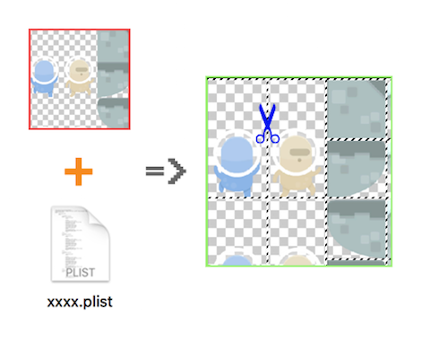
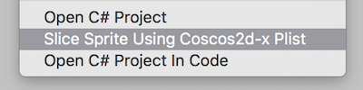

# Unity3D-TextureAtlasSlicer-Cocos2d-x
Simple and fast tool to import Cocos2d-x spritesheets (TextureAtlas) into Unity3D! *This project is base on the [Unity3D-TextureAtlasSlicer](https://github.com/toxicFork/Unity3D-TextureAtlasSlicer)*.

## Usage
- Copy the `TextureAtlasSlicer-Cocos2d-x` folder to your project's assets directory.
- Import the sprite and the plist file (with the same name as the sprite) to your project's Asset.
- Right click on the scripte you want to slice and select the `Slice Sprite Using Coscos2d-x Plist` menu item. 
- Configure the pivot settings.
- Hit `Slice`!
